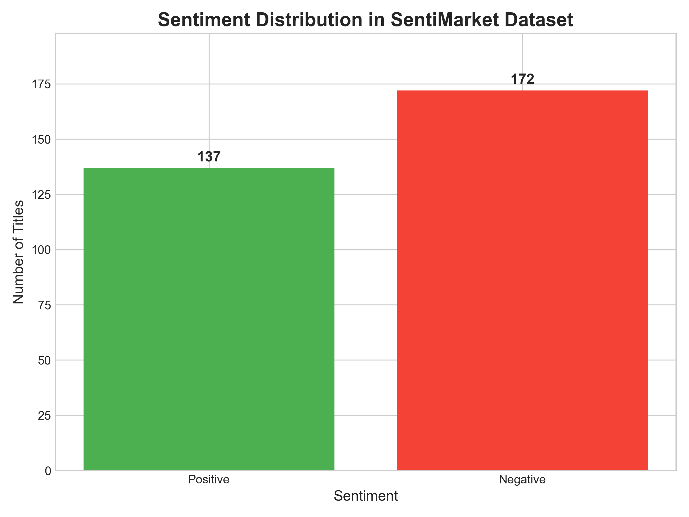
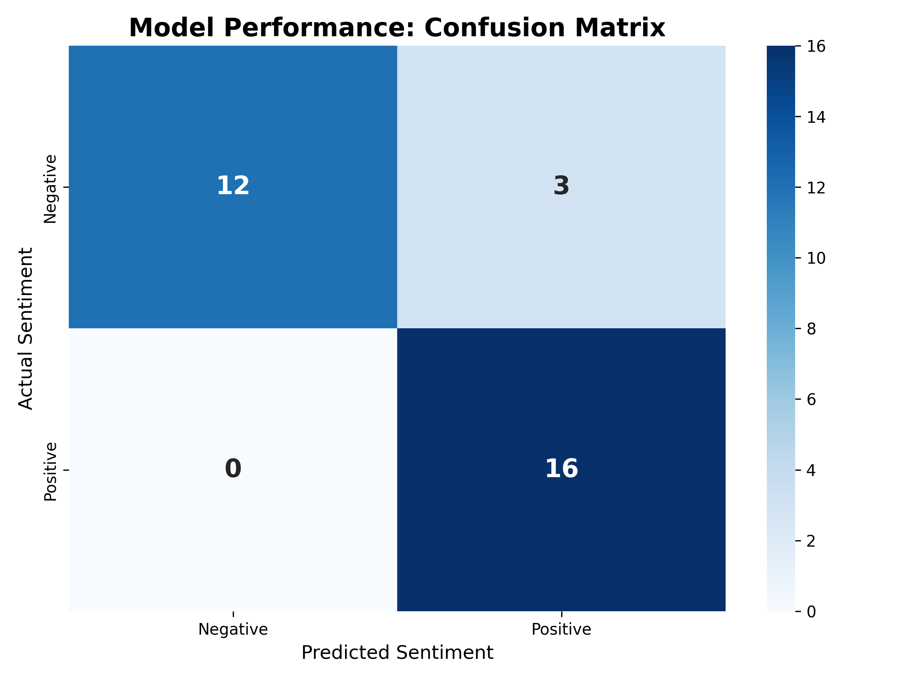
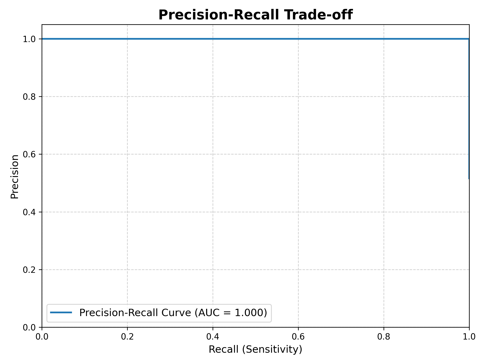
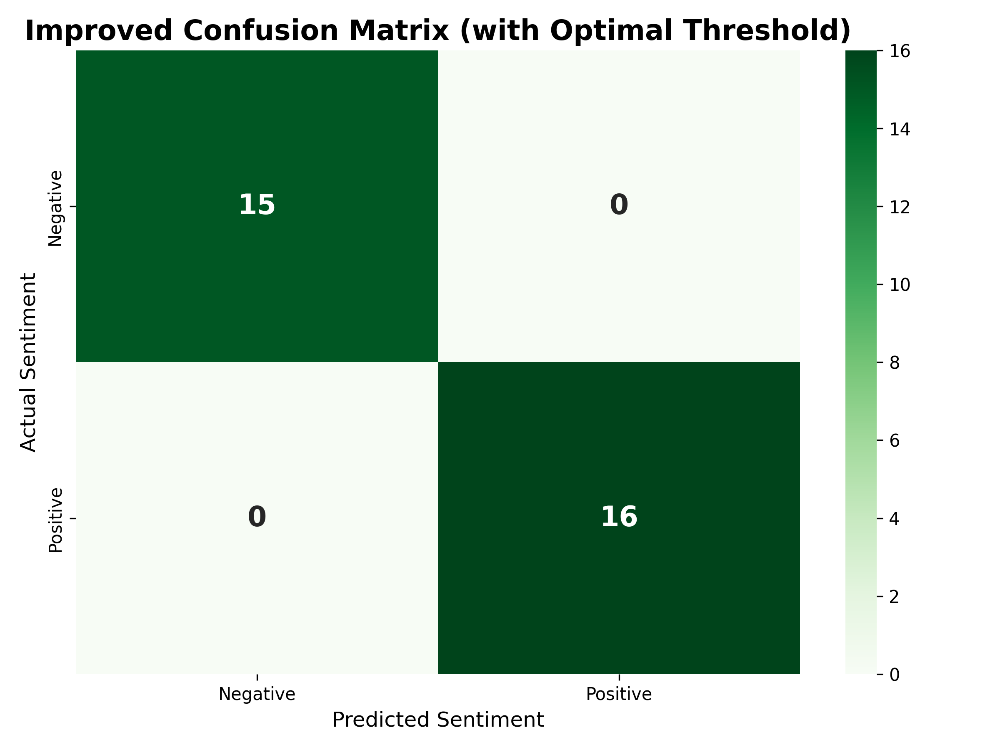

# 📈 SentiMarket: A BERT-based Financial Sentiment Analysis Tool

This project showcases a BERT model fine-tuned to classify the sentiment of financial news headlines. The model was trained on a custom-labeled dataset and optimized to achieve high accuracy.

➡️ **[Click here to try the Live Interactive Demo!](https://huggingface.co/spaces/charlieskyward/SentiMarket)** ⬅️

---

## ## Problem Statement

Financial markets are heavily influenced by news and public sentiment. This project aims to automate the process of sentiment analysis for financial headlines. The core of this project is a `bert-base-uncased` model that has been fine-tuned to understand the specific nuances of financial language, classifying text as either **Positive** or **Negative**.

---

## ## Dataset Insights

The model was trained on a custom dataset of 310 financial news headlines, manually labeled to ensure quality. The dataset was intentionally kept balanced between the two classes to prevent model bias, which is a crucial step for building a reliable classifier.

---

## ## Model Performance & Optimization

The fine-tuning process resulted in a dramatic performance increase, taking the model from a baseline guess to a highly accurate classifier.

### Initial Performance
The initial fine-tuned model achieved **90.3% accuracy** on the validation set, a significant improvement from the pre-trained model's baseline of ~51%. The initial confusion matrix shows the raw performance using a default 50% decision threshold.

### Performance after Optimization
Further analysis revealed that the model's predictions could be perfected by tuning the decision threshold. This was possible because the model achieved perfect class separation on the validation set, resulting in a Precision-Recall Area Under the Curve (AUC) of 1.000.

By finding the optimal threshold of **0.7707**, the model achieved **100% accuracy** on the validation set, as shown in the final confusion matrix.

---

## ## Technologies Used

* **Python**
* **TensorFlow / Keras**
* **Hugging Face Transformers** (for BERT model and tokenization)
* **Gradio** (for the interactive web demo)
* **Git & Git LFS** (for version control and handling large model files)
* **Scikit-learn & Matplotlib/Seaborn** (for performance evaluation and visualization)
