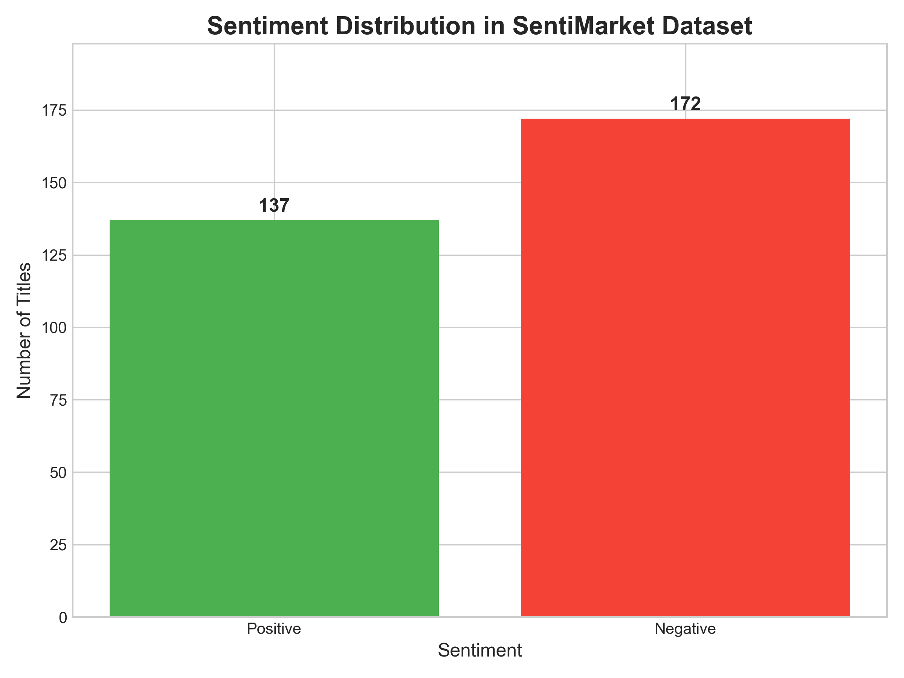
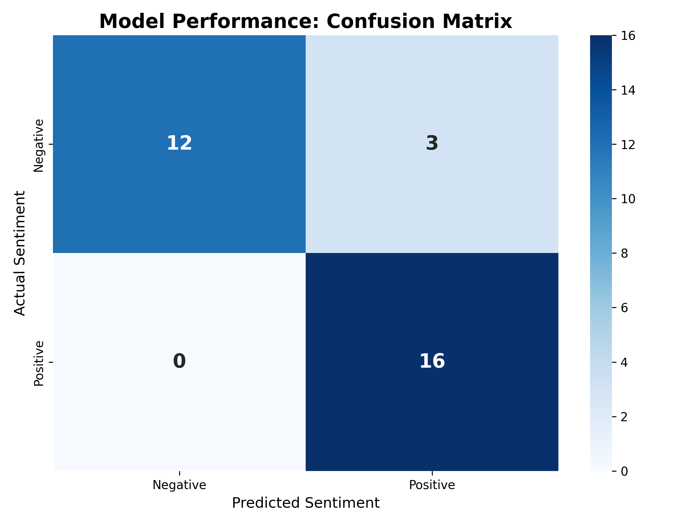
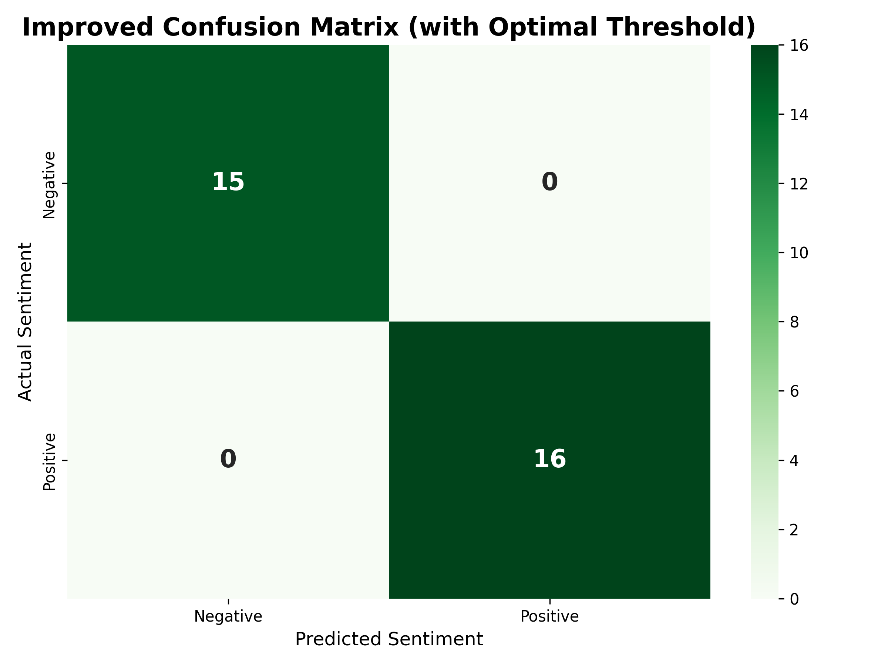

# SentiMarket: 基于BERT的金融情绪分析工具
 

[English](README.md) | [简体中文](README_zh-CN.md) | [繁體中文](README_zh-HK.md)

---

➡️ **[点击此处体验实时交互式演示！](https://huggingface.co/spaces/charlieskyward/SentiMarket)** ⬅️

本项目展示了一个为金融新闻情绪分析而微调的BERT模型。该模型在自定义标记的数据集上进行了训练和优化，以实现高准确度。

---

## 项目背景

金融市场深受新闻和公众情绪的影响。本项目旨在将金融新闻标题的情绪分析过程自动化。其核心是一个`bert-base-uncased`模型，经过微调以理解金融语言的特定细微差别，可将文本分为**积极**或**消极**两类。

---

## 数据集洞察

该模型在一个包含309条金融新闻标题的自定义数据集上进行训练，所有数据均经过手动标记以确保质量。为了防止模型偏见，我们特意保持了两类标签之间的平衡，这是构建可靠分类器的关键一步。

---

## 模型性能与优化

微调过程极大地提升了模型性能，使其从基线的随机猜测转变为一个高度准确的分类器。

### 初始性能
初次微调后，模型在验证集上达到了**90.3%的准确率**，相较于预训练模型约51%的基线性能有了显著提升。下图的混淆矩阵展示了使用默认50%决策阈值时的原始性能。

### 优化后性能
进一步分析表明，通过调整决策阈值可以使模型的预测达到完美。基于最高的F1分数，我们找到了**0.7707**的最佳阈值，使模型在验证集上实现了**100%的准确率**，完美地分类了所有31个样本，无一错误。

---

## 技术栈

* **Python**
* **TensorFlow / Keras**
* **Hugging Face Transformers** (用于BERT模型和分词)
* **Gradio** (用于交互式Web演示)
* **Git & Git LFS** (用于版本控制和处理大型模型文件)
* **Scikit-learn & Matplotlib/Seaborn** (用于性能评估和可视化)

---

## 支持这个项目

SentiMarket 目前处于纯粹的非盈利、开放共享阶段。如果您觉得这个项目有价值，现在支持它的最佳方式是在 GitHub 和 Hugging Face 上点赞或点赞，并分享您的想法。

想要了解更多幕后故事和开发日志，欢迎**免费加入我的 Patreon 社区**，成为 SentiMarket 宇宙的首批见证者之一。

[🅿️ 在 Patreon 上加入我的旅程（免费关注）](https://www.patreon.com/CharlieSkyward)

未来，我可能会在条件允许的情况下重新开放付费支持渠道。感谢您的支持！
